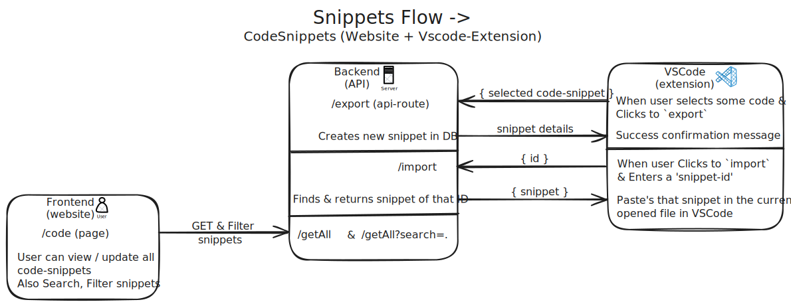
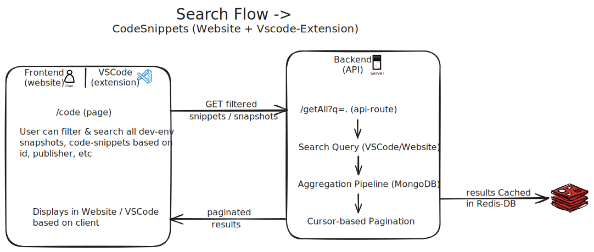

# code-snippets-platform

## 🔁 Feature Workflows

  <a href="assets/authFlow_codesnippets.svg" download>
    <h2><strong>1.</strong> Auth Feature Workflow</h2>
  </a>
  

  <a href="assets/snippetsFlow_codesnippets.svg" download>
    <h2><strong>2.</strong> Snippets Feature Workflow</h2>
  </a>
  

  <a href="assets/snapshotsFlow_codesnippets.svg" download>
    <h2><strong>3.</strong> Snapshots Feature Workflow</h2>
  </a>
  

  <a href="assets/searchFlow_codesnippets.svg" download>
    <h2><strong>4.</strong> Search Feature Workflow</h2>
  </a>
  

## Features Implementaion Flow ->

**1. Implement Auth**

**2. Snippets management**

**3. Snapshots management**

**4. Profile & Dashboard**

**5. Search (snippets & snapshots) management**
